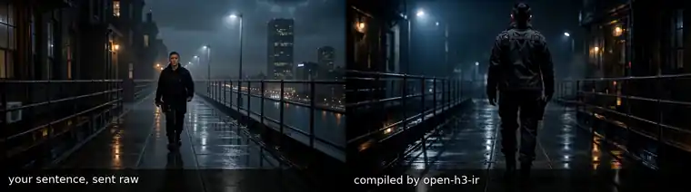
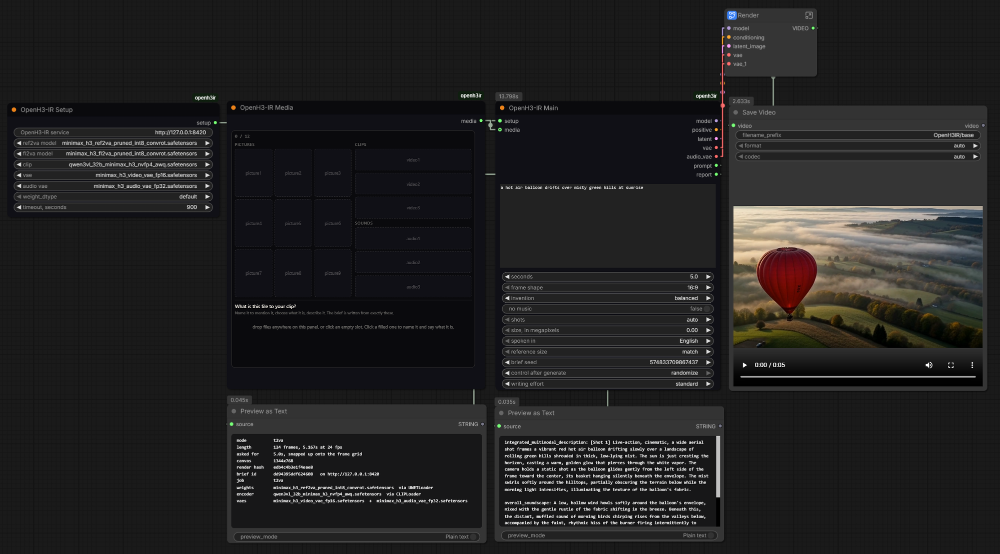

# OpenH3-IR

Open-source local Context-IR for MiniMax H3.

[](https://github.com/ruashots/open-h3-ir/actions/workflows/ci.yml)

**Type one sentence. Get better video out of MiniMax H3.**



*Same model, same seed, same reference image. The only difference is the words.*

H3 does not want a prompt. It wants a structured document: named sections in a fixed order, every
subject bound to a numbered picture label, cut times that land on a legal frame grid. That document is
what MiniMax calls the Context-IR, and writing it is the whole job here. MiniMax
open-sourced the model but not the stage that writes that document, saying only that
["H3-Context-IR is critical to the quality of the final output"](https://huggingface.co/MiniMaxAI/MiniMax-H3)
and that you should call their hosted service for it.

This is an open one, running on your own machine, with a dial on top of it. Use it
[from ComfyUI](#in-comfyui-three-nodes), where it is three nodes, or
[over HTTP](#over-http-from-anything) from anything else. Same compiler behind both, and neither is
the poor relation.

It talks to any OpenAI-compatible endpoint you already have up. Ollama, llama.cpp's server, LM Studio
and vLLM all speak that API, so if you already run local models there is nothing new to stand up. The
compiler needs no GPU of its own, because the weights live at the endpoint, and nothing here ever
calls MiniMax.

## What you are looking at

Both halves are the same request: *"she walks out onto the wet gantry in the rain and stops when she
sees the city below."* On the left that sentence goes to H3 as typed. On the right it goes through
`h3ir` first. Nothing else moved between the two runs: same reference image, same seed, same 10.125
seconds, same settings.

The right side does what the sentence asked. She walks out along the gantry, and at five seconds it
cuts to a low-angle close-up of her looking down at the city.

The left side is a good-looking clip that never arrives. It cannot decide where she is going, walking
toward camera for the first half and away from it in the second, and the railing and the skyline
behind her change into a different place along the way. She never looks down, so the beat the whole
sentence was built around is missing. Nothing on that side is badly rendered, and that is the point:
the model was fine, the words were the problem.

**Watch it with sound:** [off-vs-on.mp4](docs/media/off-vs-on.mp4). H3 generates the rain and the
score in the same pass as the picture. GitHub cannot play a repo-hosted mp4 inline, so the animation
above is the silent version and the file is the one with audio. The brief that produced the right
half is committed beside it:
[`off-vs-on.compiled-brief.txt`](docs/media/off-vs-on.compiled-brief.txt).

## And a dial, for how far it goes


*"the car rolls into the showroom and stops under the lights."* Run twice, changing one flag.

`restrained` stays on the car and keeps its hands still: one slow low-angle track, one cut at six
seconds to a held medium shot, no music, and the room never really revealed. `extreme` turns the same
sentence into a car commercial. It opens wide on the empty showroom, cuts at three and a half seconds
to a close-up panning along the front wheel, finishes on a low-angle push-in, and puts a score under
all of it. Two shots became three, and the camera stopped being polite.

Both reference plates are committed, so this runs as written:

```bash
h3ir compile "the car rolls into the showroom and stops under the lights" \
  --image docs/media/plate-car.jpg \
  --image docs/media/plate-showroom.jpg \
  --seconds 10 --creativity extreme
```

Swap `extreme` for `restrained` and you get the left half. Four positions in all: `restrained`,
`balanced` (the default), `bold`, `extreme`. What changes is how much the writer may introduce that
you never asked for, and an explicit "no dialogue" at `extreme` still means no dialogue.

**Watch it with sound:** [dial-restrained-vs-extreme.mp4](docs/media/dial-restrained-vs-extreme.mp4).
Both briefs are committed too, so you can read exactly what the flag did:
[restrained](docs/media/dial-restrained.brief.txt) and
[extreme](docs/media/dial-extreme.brief.txt).

## Two ways in

**In ComfyUI it is three nodes**, and a workflow that ships already wired, so once you have pointed it
at your own H3 files it is a sentence and a run. That one sentence stands in for the text box, the
resolution picker, the frame-count arithmetic, four file loaders and the H3 conditioning node.
[**In ComfyUI: three nodes**](#in-comfyui-three-nodes) below, then
[`comfyui/README.md`](comfyui/README.md) for the whole surface.

**Over HTTP it is a service.** One `POST` with a sentence in it comes back with a validated brief and a
list of which file belongs where, so nothing in your application ever has to understand H3's format.
[**Over HTTP, from anything**](#over-http-from-anything) below, then
[`docs/calling-the-api.md`](docs/calling-the-api.md) for what it guarantees and what it only attempts.

Install is the same work for both, because both doors are the same service: the ComfyUI nodes carry no
compiler of their own, they speak HTTP to `h3ir serve`. There is a `h3ir` command line as well, and it
is what the examples further down are typed against, because a terminal transcript is the one thing
this page can show you without asking you to take it on trust.

## Install

Python 3.10 or newer, and an OpenAI-compatible LLM endpoint. vLLM, llama.cpp's server, LM Studio and
Ollama all speak that API. Nothing here calls MiniMax, and the compiler itself wants no GPU: the
endpoint is where the weights live.

Give that endpoint a vision-capable model if you want to pass reference images, since that is how the
pictures get read. Text-only prompts never send an image, so they work against a plain chat model.

Every brief on this page was written by Qwen3.6 27B, 4-bit, served by vLLM at 262K context on two RTX
3090s, and H3 rendered the videos from those briefs. That is what the project is proven against, and
it is the bar to size your own box against: a 27B-class local model that can also look at images is
enough.
`h3ir eval` is there to measure what a different endpoint does to brief quality rather than guess at
it.

```bash
git clone https://github.com/ruashots/open-h3-ir.git
cd open-h3-ir
python3 -m venv .venv && . .venv/bin/activate
pip install -e ".[dev]"

export H3IR_LLM_URL=http://your-endpoint:8000/v1   # the only setting most people change
h3ir doctor
```

The project is called `open-h3-ir`. The command and the import are both `h3ir`, which is what you
type.

`h3ir doctor` tells you what is actually answering before you debug anything else: the endpoint, the
model it serves, its context length, whether ComfyUI is reachable and which H3 nodes it has, and a
tokenizer self-test. Two commands need nothing running at all if you want to poke at it before
configuring anything: `h3ir controls` and `h3ir budget --seconds 10`.

Every setting, with the reason for each default, is in [`.env.example`](.env.example).

One thing worth saying plainly: I am building this because I need it for another application I am
making, which is why it is shaped the way it is. It does what that application needs, correctly,
rather than being a general framework for writing prompts. Expect a few changes as I go, and pin a
commit if you build on it.

## In ComfyUI: three nodes



The pack is the [`comfyui/`](comfyui/README.md) folder of this repository. Copy or link that one folder
into `custom_nodes` and restart ComfyUI.

```bash
# from inside the clone, where Install left you
cp -r comfyui /path/to/ComfyUI/custom_nodes/openh3ir
```

On Windows a junction means a `git pull` updates the pack too:

```
mklink /J "C:\ComfyUI\custom_nodes\openh3ir" "C:\path\to\open-h3-ir\comfyui"
```

It adds no packages to ComfyUI's Python. The nodes speak HTTP to `h3ir serve` with the standard
library alone, so the compiler's dependencies can never break a ComfyUI install and the service is
free to sit on another machine. Besides that service, the pack needs what any H3 render needs: a
ComfyUI with the MiniMax H3 nodes, which ship with ComfyUI itself, and H3's own model files on disk.

Then open the workflow in the picture, which ships with the pack:
[`comfyui/example/openh3ir_base_workflow.json`](comfyui/example/openh3ir_base_workflow.json). Point
Setup at your own five H3 files, type a sentence over the one that is in there, press run. Seven boxes
on the canvas and that is the whole thing: the three of this pack, one called **Render** with the
rendering machinery folded up inside it, one that saves the video, and two panels that show you the
brief that got written and the report of what happened. Nothing in it is set up to be fast or clever,
so what comes out is H3 as it ships. The balloon clip in the corner is that workflow's own output, from
the sentence you can read on the node beside it.

**OpenH3-IR Main** is the sentence and the knobs, and it is the node that removes the boxes: no text
box to paste a document into, no resolution picker, no frame-count arithmetic, no row of file loaders.
It works out which of H3's files this particular job needs, opens them, and hands the render everything
it takes to run, which is why nothing else on the canvas needs setting up. It also hands you the brief
it wrote and a report of what it did.

Beside the sentence sit the knobs you would expect and no more: the length, the frame shape, how much
the writer may invent, a switch for no music, the shot count (`auto`, or a number from 1 to 10 that is
kept exactly), the frame size in megapixels, and the language every locked line is spoken in.

**OpenH3-IR Media** is the tray: nine pictures, three clips and three sounds on one panel, dropped or
picked. Every slot carries three things, and no amount of wiring could say any of them.

- **A name**, which is what the sentence calls the file by.
- **What it is**, in plain words. A picture is *something in the shot*, *the setting*, *a style to
  copy*, *first frame*, *last frame* or *storyboard*. A clip is *copy what is in it*, *copy how it is
  shot*, *edit it* or *carry on from it*. A sound is *play it*, *match its style*, *cut to its beat*,
  *sound effect* or *voice to match*.
- **A line about it.** Optional for a picture, which gets looked at. Close to essential for a sound,
  which does not: nothing in this chain can hear, so the line you type is the only thing that will
  ever know what a track sounds like.

**OpenH3-IR Setup** holds the service address and the five H3 files to load. It is a picker and
nothing else: it lists what is actually on your disk, and the file you choose is the file that loads.
No search by name, no preferred build, no option meaning "work it out". H3 ships two models that do
different jobs, and no filename can tell anyone which one you meant today, so the answer stays yours,
it stays readable on the node, and the report names every file that was opened.

The prompt on Main is ordinary prose, and `@` is how it points at the tray:

> *@carguy prowls across @showroom and stops under the ring light, and an unseen announcer
> @speaks("Nothing on this floor moves like it.")*

A mention becomes that slot's own description in the document, so the compiler never has to guess
which words mean which file. Whatever sits inside `@speaks("...")` comes back in the brief word for
word and mark for mark, because a brief that rewords a locked line is refused and rewritten. A
mention that names no slot is refused on the canvas, listing the names that do exist, before any
model call is spent. That is the whole syntax: mentions, locked lines, prose, nothing else.

Whatever it did, it tells you. The report panel in the picture is that output: the length it really
rendered, every file it opened, and one line per attachment tying the slot you named to the picture H3
actually received, matched by the file's own contents rather than by position. A name landing on the
wrong file is the kind of mistake you would otherwise spend an evening blaming on the model.

Some combinations stay impossible, and the nodes say so instead of rendering something wrong. A picture
that *is* the first frame of the video and a picture that is merely something the shot should contain
are two different jobs, and H3 released a separate model for each. The frame one accepts no references
at all, so setting one slot to *first frame* while another slot holds a reference is two jobs at once.
That is refused on the canvas, in a full sentence naming both slots, before a file is written or the
writing model is called.

Two more things worth knowing before you wire anything. There is one `seconds` field and it is the only
place length is set, because H3's frame grid has to be snapped once and then used for the brief and the
render together. And the tray is an ordinary text field under the panel, so a saved workflow and a
rendered video both carry it: drag the mp4 back onto the canvas and the slots come back, names, roles
and notes intact.

The wiring, the two file formats, every failure message and what the pack will not do:
[`comfyui/README.md`](comfyui/README.md).

## Over HTTP, from anything

The API is the product and the CLI is one of its clients. No quality-bearing field is reachable only
from a UI, and no path skips the validator.

```bash
h3ir serve --port 8420
curl -s localhost:8420/v1/briefs -H 'content-type: application/json' \
  -d '{"intent":"a lighthouse keeper lights the lamp in a storm","seconds":10}'
```

`intent` is the only required field. Every response comes back in three layers: `presentation` for a
screen to show, `plan` for the creative decisions someone might want to change, and `ir` for whoever
wires the graph. `GET /v1/capabilities` reports the legal durations, aspects and asset limits, so a
caller never hardcodes them.

Under-specification never fails. `{"intent":"make a video of my dog"}` and nothing else comes back
`201` with a complete, zero-error brief: five seconds, widescreen, the edit and the sound picked for
you. Routes and request shapes: [`docs/calling-the-api.md`](docs/calling-the-api.md).

## Your first brief

This is the exact command that produced the right-hand side of the first video, and `ref1.png` ships
in the repo, so you can run it now.

```console
$ h3ir compile "she walks out onto the wet gantry in the rain and stops when she sees the city below" \
    --seconds 10 --image h3ir/golden/assets/ref1.png

mode=ref2va  tokens=708  timings={…}
==========================================================================
ref2va IR
  -> PASS (with warnings)   0 error(s), 2 warning(s), 0 info
==========================================================================
  [WARN] P2-too-short: detailed_description is 265 words; spec guidance 350-500, official example 336
  [WARN] R15-wardrobe-not-restated: [Shot 2] names the subject but not the garments (jacket, shirt,
         t-shirt); wardrobe drifts between shots when it is only stated once

subject_definitions:
<Subject 1> is the woman in <Picture 1>, with short dark hair with shaved sides and a small top knot,
dark complexion, black tactical jacket with shoulder straps and buckles, black t-shirt, black cargo
trousers, black lace-up combat boots, slender build.
[…]
detailed_description:
The target video is in a cinematic, high-contrast style with realistic 3D character design, featuring
cool blue tones and wet, reflective surfaces.
[Shot 1] A medium-long tracking shot follows <Subject 1> from behind as she walks out onto a wet,
metallic gantry in the rain. The camera tracks slowly with small amplitude, keeping her centered in
the frame as she moves away from the viewer. […]
[Shot 2] At 00:05.000, the shot cuts to a close-up of <Subject 1> from a slightly low angle as she
stops at the edge of the gantry. The camera is static, focusing on her face and upper body. She looks
down, her expression shifting to one of quiet contemplation as she sees the city below. […]
```

A real run, cut at `[…]`. Nobody typed `<Subject 1>`, `<Picture 1>`, `00:05.000`, or any section
name. One image path went in with no description of what was in it, and the tactical jacket, the
shaved sides and the combat boots were read off the pixels.

Both findings are warnings rather than errors, so it compiled. The second one is the interesting
kind: Shot 2 names the woman but not her clothes, which is the exact omission that lets wardrobe
drift between cuts. No legality check can see that, so it is a named rule with a reason attached.

## Your dialogue ships exactly as you typed it

```bash
h3ir compile "two engineers argue in a server room while an alarm blinks" --seconds 10 \
  --say "The backup never ran, Mei." \
  --say "Then we tell them tonight."
```

From what came back:

```
[…] The camera holds a static shot as the woman with a sharp, urgent voice (S1) says:
<d>[English] The backup never ran, Mei.</d> The man turns his head slightly toward her, his
expression serious, and replies with a calm, steady tone (S2): <d>[English] Then we tell them
tonight.</d> The red alarm continues to flash in the background […]
```

Your lines never pass through the writing model. It decides who speaks, casts a voice for each of
them, places the lines in the scene, and the renderer substitutes your words back byte for byte. In
ComfyUI the same guarantee is `@speaks("...")` inside the sentence.

## Ask for ten seconds and H3 gives you 10.125

```console
$ h3ir budget --seconds 10
requested 10.0s -> 243 frames = 10.125s (nominal S.SS 10.13)
canvas 1344x768, latent_t 72
video rows 72,576  audio rows 810
ref image at 'match' ~1,008 rows; at 'max' (2048 short edge) ~7,296 rows
an 800-token IR is 1.08% of the pack
```

H3 only makes clips whose frame count fits a fixed grid. There are exactly fifteen legal lengths
between 5.167s and 15.083s, and **only one of them is a whole number of seconds** (8.0s, at 192
frames). Ten is not on the grid, so 243 frames at 10.125s is the closest the model can get.

Ask for a round number and you quietly get something else. It matters the first time you cut to
music, and it matters for every cut time inside the clip, which is why the compiler owns those and
the writing model never picks one.

The same output prices your references. Prompt text is nearly free and attachments are what cost: one
reference image at maximum sizing runs about nine times the cost of an 800-token brief. Write long,
attach few. The arithmetic is in [`docs/design.md`](docs/design.md).

## Attach an image and it picks the mode for you

H3 does not have one mode, it has five, and each wants the document written differently. Which one a
request needs is settled by what you attached, because that is the only thing that can settle it
correctly. You never pick one and no screen built on this should ask. The names show up in the report
if you are curious: `t2va`, `i2va`, `fl2va`, `l2va`, `ref2va`.

Attach two images and two subjects come back, each with its own numbered label, its own stated promise
about what has to stay the same about it, and a mention in every shot it appears in. If an image is
ambiguous about which of several things in it you care about, `--image path.png:"the pilot"` says which,
straight to the model that looks at it. In ComfyUI the same hint is the slot's own line about the file.

## What it will not do

- **It does not make the video itself.** It writes the words and hands over everything the render needs.
  Over HTTP that is a brief plus which file belongs where; in ComfyUI it is the wires that feed the
  Render box, and every box inside there is ComfyUI's own rather than ours.
- **It does not judge whether the writing is good.** It can tell you a shot dropped the wardrobe. It
  cannot tell you the edit is dull.
- **It cannot hear.** The model that reads your files can look and cannot listen, and a model asked
  what a piece of music is like will invent a confident answer rather than admit that. So a sound is
  described from the line you type about it, plus its own file details, plus a transcript if you have
  one.
- **It does not guarantee a face survives the render.** The brief binds the reference and states what
  must be preserved. Whether the model delivers is a render outcome.
- **It is H3-only, all the way down.** The rules, the frame grid and the section names are H3's.
  Pointing it at another video model would be a rewrite, not a config change.

## How it keeps itself honest

A rule that cannot be made to fire is not a rule, so every one is proved in both directions.

```console
$ h3ir controls
22 controls, 0 failing
```

MiniMax's own published briefs have to validate clean, because a rule that fires on the spec's own
artifact is a wrong rule. That direction has already caught two rules here and demoted them to
guidance. There is one documented exemption, where MiniMax's example omits a camera motion type.

Going the other way, fifteen mutants of that example each carry exactly one defect and each has to
trip a rule by name, out of the more than a hundred the validator knows. The whole gate runs in under
a second and needs no model.

Legality is not quality, so `h3ir eval` separately scores six briefs and gates a change against a
stored baseline, because a prompt change can improve one and wreck the other.

```console
$ pytest -q
896 passed, 2 skipped, 1 warning in 2.24s
```

No model, no GPU, no network. The two skips are about this machine rather than holes in the suite: one
wants `torch` installed so it can check the ComfyUI file readers against real image data, the other
wants an `ffprobe` that can measure a webp.

## Where to look next

| file | what it is for |
|---|---|
| [`comfyui/README.md`](comfyui/README.md) | **the node pack**: the workflow that ships with it, the tray, the `@` prompt, the wiring, every failure message |
| [`HANDOFF.md`](HANDOFF.md) | **installing the service and making it run**, step by step, with a check on every step. Written so you can hand the path to an agent and walk away |
| [`AGENTS.md`](AGENTS.md) | **changing the compiler**: the rules that are not preferences, which file owns what, the known gaps |
| [`docs/calling-the-api.md`](docs/calling-the-api.md) | driving the service from an application: what it guarantees, what it only attempts, what comes back |
| [`docs/design.md`](docs/design.md) | why every rule exists: what the encoder sees, the cost model, the contract between stages |
| [`docs/build-log.md`](docs/build-log.md) | a dated record of what the build measured, including the positions it reversed |
| [`loras/handpainted-anim-v2/`](loras/handpainted-anim-v2/) | a worked example of the style-LoRA registry format (the weights there are a labelled placeholder) |

## Licence

Apache 2.0. See [LICENSE](LICENSE), and [NOTICE](NOTICE) for what belongs to whom.

**That covers this compiler and this node pack. It does not cover the model you point them at, and
H3's own licence is more restrictive than you might assume.** Three terms worth knowing before you
build on this, because none of them is guessable:

- **H3 is not licensed for use in the European Union, the United Kingdom, the Republic of Korea or
  the United States of America.** Those are its Excluded Territories, and the grant is worldwide
  except for them. MiniMax invites people there to contact them for a licence.
- A commercial product or service using H3 **shall prominently display "MiniMax H3" in its user
  interface** (section IV.2).
- Commercial products earning **more than 20 million USD a year need separate written authorization**
  from MiniMax first (section IV.1).

Read the [MiniMax H3 Community License Agreement](https://huggingface.co/MiniMaxAI/MiniMax-H3/blob/main/LICENSE)
rather than trusting this summary. Nothing in this repository is a MiniMax work: no model code, no
weights, no checkpoint.
